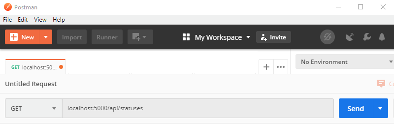

# Feladat 1: Státuszok kezelése (8p)

Ebben a feladatban a státusz entitáshoz tartozó alapműveleteket fogjuk megvalósítani.

## Visual Studio solution megnyitása

Nyisd meg a letöltött repository-ban a Visual Studio solution-t (`.sln` fájl). Ha a megnyitás során a Visual Studio azt jelezni, hogy a projekt típus nem támogatott, akkor telepítsd a Visual Studio hiányzó komponenseit (lásd [itt](../VisualStudio-install.md)).

> **NE** frissítsd a projektet, se a .NET Core verziót, se a Nuget csomagokat! Ha ilyen kérdéssel találkozol a solution megnyitása során, akkor mindig mondj nemet!

A solution struktúrája a többrétegű alkalmazás felépítésének megfelelő:

- A `Controllers` mappa tartalmazza a Web Api controllereket, mely a REST kéréseket kiszolgálja.
- A `DAL` mappa tartalmazza az adatelérést, amely egyrészt egy repository réteget, másrészt egy Entity Framework Code First modellt tartalmaz.
- A `Model` mappában a közösen használt entitás osztályok találhatóak.

Munkád során a `DAL.StatusesRepository` és `Controllers.StatusesController` osztályokba dolgozz! Ezen fájlok tartalmát tetszőlegesen módosíthatod (feltéve, hogy a repository továbbra is megfelel a `IStatusesRepository` interfésznek, és természetesen továbbra is fordul a kód).

## Webalkalmazás elindítása

Próbáld ki, hogy elindul-e a program.

1. Fordítsd le és indítsd el Visual Studio-ból az alkalmazást.

1. Nyisd meg böngészőben a <http://localhost:5000/api/ping> oldalt.

Ha minden rendben ment, akkor a böngészőben a "pong" szöveget látod, és a futó alkalmazás logjában látható a kiszolgált kérés.

## Minden státusz listázása (4p)

Valósítsuk meg az első műveletet, amely minden státusz entitást listáz.

1. Nyisd meg a `Model.Status` osztályt. Ez írja le az üzleti logika számára milyen tulajdonságokkal rendelkezik a státusz entitás.

   > Ezt az osztályt **NE** módosítsd.

1. Nyisd meg a `DAL.EfDbContext.DbStatus` osztályt. Ez a státusz entitás adatbázisbeli reprezentációja, de még üres. Írjuk meg az osztályt:

   ```csharp
   public class DbStatus
   {
       public int Id { get; set; }
       public string Name { get; set; }
   }
   ```

   Az `Id` lesz az adatbázisbeli kulcs, a `Name` pedig a státusz neve.

1. Nyisd meg a `DAL.EfDbContext.TasksDbContext` osztályt. Ide fel kell vegyük a státuszokhoz tartozó DbSet-et, és az `OnModelCreating` függvényben konfigurálnunk kell a C# osztály - relációs adatbázis leképzést:

   ```csharp
   public class TasksDbContext : DbContext
   {
       public DbSet<DbStatus> Statuses { get; set; }

       protected override void OnModelCreating(ModelBuilder modelBuilder)
       {
           modelBuilder.Entity<DbStatus>()
               .ToTable("statuses");
           modelBuilder.Entity<DbStatus>()
               .HasKey(s => s.Id);
           modelBuilder.Entity<DbStatus>()
               .Property(s => s.Name).HasMaxLength(50).IsRequired(required: true).IsUnicode(unicode: true);
       }
   }
   ```

   A fentiekkel megadtuk a használandó tábla nevét, a kulcsot (amely így automatikusan inkrementált lesz, azaz nem kell értéket adnunk neki), és végül a névhez tartozó megkötéseinket.

1. Menj a `DAL.StatusesRepository.List()` függvényhez. Ez a repository réteg, amely az adatbázissal Entity Framework-ön keresztül kapcsolatba lép. Listázzuk ki az összes státuszt az adatbázisból:

   ```csharp
   public IReadOnlyCollection<Model.Status> List()
   {
       return db.Statuses.Select(ToModel).ToList();
   }
   ```

   A `db` változónk a DbContext, amely a dependency injection keretrendszer használatával injektálásra kerül.

1. A `ToModel` függvény egy segédfüggvény lesz, amelyet többször használunk. Ez képezi le az adatbázisból érkező C# osztályt a modellként használt másik C# osztályra. Ezt is írjuk meg (ugyanide, a repository osztályba).

   ```csharp
   private static Model.Status ToModel(DbStatus value)
   {
       return new Model.Status(value.Id, value.Name);
   }
   ```

1. A repository réteg után következik a controller. Nyisd meg a `Controllers.StatusesController` osztályt. Az URL az osztály felett már elő van készítve, minden végpont ebben a controllerben a `/api/statuses` címre érkező kérésekkel foglalkozik. A dependency injection is konfigurálva van, így a konstruktor átveszi a repository interfészét (_nem_ a repository osztályt, amit írtunk!).

   Írjuk meg a `GET /api/statuses` kérésre válaszoló végpontot:

   ```csharp
   public class StatusesController : ControllerBase
   {
       // ...

       [HttpGet]
       public IEnumerable<Status> List()
       {
           return repository.List();
       }
   }
   ```

1. Fordítsd le és indítsd el az alkalmazást.

1. Nyisd meg a Postman-t és küld a <http://localhost:5000/api/statuses> címre egy GET kérést.

   

   Akkor sikeres a hívás, ha a Postman szerint 200 a válaszkód, és üres a válasz. Ha valami hiba lenne, akkor a Visual Studio Output ablakát ill. a futó konzol alkalmazás logját érdemes nézni.

1. Üres adatbázissal nehéz tesztelni. Állítsd le a futó alkalmazást, menj meg a `DAL.EfDbContext.TasksDbContext.OnModelCreating` függvényéhez, és illesszünk be egy kevés un. _seed_ adatot az adatbázisba:

   ```csharp
   public class TasksDbContext : DbContext
   {
       protected override void OnModelCreating(ModelBuilder modelBuilder)
       {
           // ...

           modelBuilder.Entity<DbStatus>()
               .HasData(new[]
               {
                   new DbStatus() { Id = 1, Name = "new" },
                   new DbStatus() { Id = 2, Name = "in progress" },
               });
       }
   }
   ```

1. Fordítsd le és futtasd újból az alkalmazást, majd add ki ismét az előbbi GET kérést. Most már nem üres a válasz, meg kell kapd a két státuszt.

## Lekérdezés és beszúrás műveletek (4p)

Az összes státusz listázása mellett még vár ránk pár alapvető művelet:

- név alapján létezés ellenőrzése (`HEAD /api/statuses/{nev}`),
- ID alapján keresés (`GET /api/statuses/{id}`),
- és új létrehozása (`POST /api/statuses`).

1. Implementáljuk az első kettőt először a repository-ban. Ügyeljünk rá, hogy a név alapú keresésnél kisbetű-nagybetű függetlenül keressünk!

   ```csharp
   public bool ExistsWithName(string statusName)
   {
       return db.Statuses.Any(s => s.Name.ToUpperInvariant() == statusName.ToUpperInvariant());
   }

   public Model.Status FindById(int statusId)
   {
       var dbRecord = db.Statuses.FirstOrDefault(s => s.Id == statusId);
       if (dbRecord == null)
           return null;
       else
           return ToModel(dbRecord);
   }
   ```

1. A hozzájuk tartozó controller végpontok pedig:

   ```csharp
   [HttpHead("{statusName}")]
   [ProducesResponseType(StatusCodes.Status200OK)]
   [ProducesResponseType(StatusCodes.Status404NotFound)]
   public ActionResult ExistsWithName(string statusName)
   {
       var exists = repository.ExistsWithName(statusName);
       if (exists)
           return Ok();
       else
           return NotFound();
   }

   [HttpGet("{id}")]
   [ProducesResponseType(StatusCodes.Status200OK)]
   [ProducesResponseType(StatusCodes.Status404NotFound)]
   public ActionResult<Status> Get(int id)
   {
       var value = repository.FindById(id);
       if (value == null)
           return NotFound();
       else
           return Ok(value);
   }
   ```

   Figyeld meg a controller metódusokon az attribútumokat és a visszatérési értékeket! Ha van tartalma a válasznak (body a http csomagban), akkor `ActionResult<T>` a visszatérési érték, ha csak státusz kódot adunk vissza, akkor `ActionResult`. Az `Ok` és `NotFound` függvények segédfüggvények a válasz előállításához.

1. Az új státusz beszúrásához ismét a repository felől induljunk. A létrehozáshoz egy segéd modell osztályt, a `CreateStatus`-t kapjuk, ebben csak egy név van. Garantálni szeretnénk a nevek egyediségét, hogy ne legyen két státusz ugyanazzal a névvel. A beszúrásnál ezt ellenőrizni fogjuk, méghozzá itt is kisbetű-nagybetű függetlenül.

   ```csharp
   public Model.Status Insert(CreateUpdateStatus value)
   {
       using (var tran = db.Database.BeginTransaction(System.Data.IsolationLevel.RepeatableRead))
       {
           if (db.Statuses.Any(s => s.Name.ToUpperInvariant() == value.Name.ToUpperInvariant()))
               throw new ArgumentException("name must be unique");

           var toInsert = new DbStatus() { Name = value.Name };
           db.Statuses.Add(toInsert);

           db.SaveChanges();
           tran.Commit();

           return new Model.Status(toInsert.Id, toInsert.Name);
       }
   }
   ```

   Figyeljünk a tranzakcióra! Először ellenőriznünk kell, van-e már hasonló név. Ha igen, akkor a hibát kivétellel jelezzük. Ha beszúrhatú a rekord, akkor a beszúrás után a tranzakciót is kommitálnunk kell. És mivel az ID-t az adatbázis generálja, a repository függvény visszaadja a létrehozott entitást, benne az új ID-val.

1. A POST http kérést az alábbi controller metódus fogja kiszolgálni:

   ```csharp
   [HttpPost]
   [ProducesResponseType(StatusCodes.Status201Created)]
   [ProducesResponseType(StatusCodes.Status400BadRequest)]
   public ActionResult<Status> Create([FromBody] Dto.CreateUpdateStatus value)
   {
       try
       {
           var created = repository.Insert(value);
           return CreatedAtAction(nameof(Get), new { id = created.Id }, created);
       }
       catch (ArgumentException ex)
       {
           return BadRequest(new { error = ex.Message });
       }
   }
   ```

   Figyeljük meg a sikeres és a sikertelen válaszokat is. Ha sikerült a beszúrás, akkor a `CreatedAdAction` segédfüggvény olyan válasszal fog visszatérni, ahol a body tartalmazza az új entitást, a _Location_ header pedig a linket, ahol az entitás lekérdezhető (ezért a hivatkozás a `nameof(Get)`-tel). Ha viszont a repository-ban eldobott kivétel érkezik, akkor jelezzük a problémát a hívónak. Ebben a válaszban a státuszkód 400 lesz, és itt is lesz body, amiben hibaszöveg lesz (hiszen a REST nem definiálja a hibajelzés további módjait a 400 válaszkódon túl).

1. Fordítsd le az alkalmazást és indítsd el. Próbáld ki a megírt kéréseket! Állítsd elő a sikeres és a sikertelen ágakat is.

1. Készíts egy képernyőképet Postman-ből (avagy más, hasonló eszközből, ha nem Postman-t használtál), amely egy **sikertelen** beszúrást mutat. (A sikertelenség oka a már létező név lesz.) A képernyőképpel kapcsolatos elvárásokat lásd [itt](../README.md#képernyőképek).

   > A képet a megoldásban `f1.png` néven add be. A képernyőképen látszódjon a kimenő kérés és a válasz is minden részletével.
   >
   > A képernyőkép szükséges feltétele a részpontszám megszerzésének.

## Következő feladat

Folytasd a [következő feladattal](Feladat-2.md).
