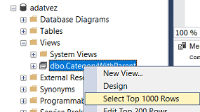

# Feladat 1: Kategória nézet és adatbeszúrás

**A feladat megoldásával 8 pont szerezhető.**

## Nézet létrehozása

Hozz létre egy nézetet `CategoryWithParent` néven a `Category` tábla kényelmesebb használatához. A nézetben két oszlop legyen: a kategória megnevezése (`Name`), és a szülőkategória (`ParentCategoryId`) megnevezése - amennyiben létezik, vagy null.

Nyiss egy új _Query_ ablakot. Ügyelj rá, hogy a jó adatbázis legyen kiválasztva. Hozd létre a nézetet az alábbi utasítás lefuttatásával.

```sql
create view CategoryWithParent
as
select c.Name CategoryName, p.Name ParentCategoryName
from Category c
left outer join Category p on c.ParentCategoryId = p.ID
```

Próbáld ki a nézetet: kérdezd le a nézet tartalmát!



## Beszúrás a nézeten keresztül

Készíts triggert `InsertCategoryWithParent` néven, ami lehetővé teszi új kategória beszúrását az előbb létrehozott nézeten keresztül (tehát a kategória nevét és opcionálisan a szülőkategória nevét megadva). A szülő kategória megadása nem kötelező, de amennyiben meg van adva a neve és ilyen névvel nem létezik rekord, dobj hibát, és ne vedd fel az adatot a táblába.

A megoldásban egy _instead of_ típusú triggerre lesz szükségünk, mert ez ad lehetőséget a nézeten keresztül történő adatbeszúrásra. A trigger vázát láthatod alább.

```sql
create trigger InsertCategoryWithParent -- name of the trigger
on CategoryWithParent -- name of the view
instead of insert    -- trigger code executed insted of insert
as
begin
  declare @newname nvarchar(255) -- variables used below
  declare @parentname nvarchar(255)

  -- using a cursor to navigate the inserted table
  declare ic cursor for select * from inserted
  open ic
  -- standard way of managing a cursor
  fetch next from ic into @newname, @parentname
  while @@FETCH_STATUS = 0
  begin
    -- check the received values available in the variables
    -- find the id of the parent, if specified
    -- throw error if anything is not right
    -- or insert the record into the Category table
    fetch next from ic into @newname, @parentname
  end

  close ic -- finish cursor usage
  deallocate ic
end
```

1. Egészítsd ki a trigger vázat a ciklusban.

    - Ha érkezik szülő kategória név, ellenőrizd, hogy létezik-e kategória olyan névvel, mint ami a `@parentname` változóban van.

    - Ha nincs ilyen, akkor dobj hibát, amivel leáll a trigger futása.

    - Ha minden rendben van, akkor szúrd be az új adatokat a `Category` táblába (ne a nézetbe, hiszen a nézet nem írható, pont ezért készül a trigger).

    !!! example "BEADANDÓ"
        A trigger kódját az `f1-trigger.sql` fájlba írd. A fájlban csak ez az egyetlen `create trigger` utasítás legyen! Semmiképpen se legyen `[use]`, se `go` utasítás a fájlban! A helyes megoldás 4 pontot ér.

1. Próbáld ki, jól működik-e a trigger! Írj egy olyan beszúró utasítást, amely sikeresen felvesz egy új elemet, és egy olyan teszt utasítást, amely során nem sikerül a beszúrás.

    A helyes és helytelen viselkedéshez feltételezheted, hogy az adatbázis a kiinduló állapotban van: olyan kategória rekordok léteznek csupán, amelyeket a létrehozó script beszúrt. A két teszt _ne_ épüljön egymásra! Mindkettő az elvárt eredményt adja attól függetlenül, hogy a másik lefutott-e már!

    !!! warning "Ékezet kerülendő"
        Érdemes olyan teszt adatokat választani, amiben nincs ékezet! Különben problémákat okozhat az sql fájl kódolásának helytelen beállítása. Hogy ezt elkerüljük, használható például a _LEGO_, mint létező szülő kategória név.

    !!! example "BEADANDÓ"
        A teszt utasításokat az `f1-ok.sql` és `f1-error.sql` fájlokba írd. Mindkét fájlban csak egyetlen `insert` utasítás legyen! Semmiképpen ne legyen `[use]`, se `go` utasítás bennük! Mindkét utasítás 2-2 pontot ér.
