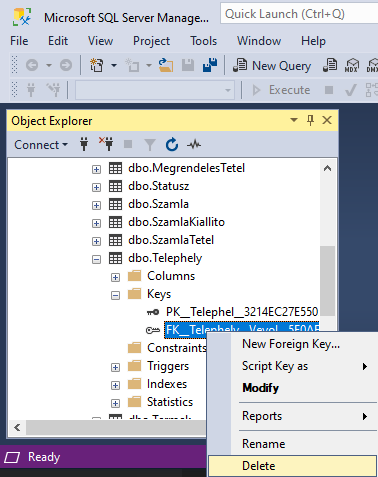
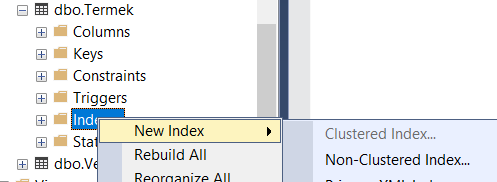
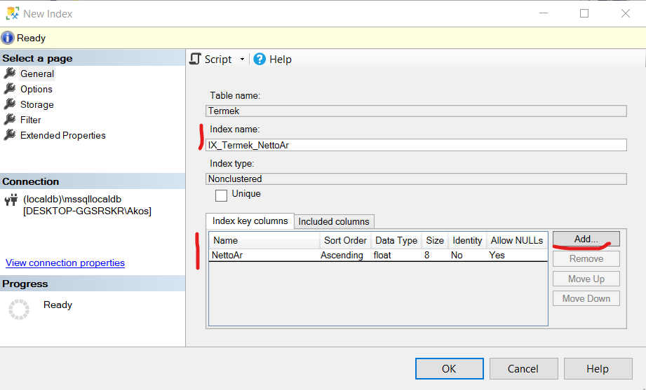

# Közösen megoldott feladatok

A feladatok megoldása során dokumentáld a `README.md` markdown fájlba:

- a használt SQL utasítást (amennyiben ezt a feladat szövege kérte),
- a lekérdezési tervről készített képet (csak a tervet, _ne_ az egész képernyőt),
- és a lekérdezési terv magyarázatát: _mit_ látunk és _miért_.

## Feladat 1 (2p)

Dobd el a _Telephely_ => _Vevo_ idegen kulcsot és a _Vevo_ elsődleges kulcs kényszerét. Legegyszerűbb, ha az _Object Explorer_-ben megkeresed ezeket, és törlöd:



Vizsgáld meg a következő lekérdezések végrehajtási tervét a _Vevo táblán_ – mindig teljes rekordot kérjünk vissza (`select *`):

- a) teljes tábla lekérdezése
- b) egy rekord lekérdezése elsődleges kulcs alapján
- c) olyan rekordok lekérdezése, ahol az elsődleges kulcs értéke nem egy konstans érték (használd a `<>` összehasonlító operátort)
- d) olyan rekordok lekérdezése, ahol az elsődleges kulcs értéke nagyobb, mint egy konstans érték
- e) olyan rekordok lekérdezése, ahol az elsődleges kulcs értéke nagyobb, mint egy konstans érték, ID szerint csökkenő sorrendbe rendezve

Add meg a használt SQL utasításokat, majd vizsgáld meg a lekérdezési terveket, és adj magyarázatot rájuk!

## Feladat 2 (2p)

Hozd létre újra az elsődleges kulcsot a _Vevo_ táblán.

> Index létrehozása: Job kattintás a táblán > Design > az ID oszlopon "Set Primary Key " és Mentés gomb, vagy az alábbi SQL utasítás lefuttatása
>
> `ALTER TABLE [dbo].[Vevo] ADD PRIMARY KEY CLUSTERED ([ID] ASC)`

Futtasd újra az előbbi lekérdezéseket. Mit tapasztalsz?

## Feladat 3 (2p)

Futtasd az alábbi lekérdezéseket a _Termek_ táblán megfogalmazva.

- f) teljes tábla lekérdezése
- g) egyenlőség alapú keresés a NettoAr oszlopra
- h) olyan rekordok lekérdezése, ahol a NettoAr értéke nem egy konstans érték (<>)
- i) olyan rekordok lekérdezése, ahol a NettoAr értéke nagyobb, mint egy konstans érték
- j) olyan rekordok lekérdezése, ahol a NettoAr értéke nagyobb, mint egy konstans érték, NettoAr szerint csökkenő sorrendbe rendezve

Add meg a használt SQL utasításokat, majd vizsgáld meg a lekérdezési terveket, és adj magyarázatot rájuk!

## Feladat 4 (2p)

Vegyél fel indexet a NettoAr oszlopra. Hogyan változnak az előbbi lekérdezések végrehajtási tervei?

Az index felvételéhez használd az _Object Explorer_-t, a fában a táblát kibontva az _Indexes_-en jobbklikk -> _New index_ > _Non-Clustered Index..._



Adj az indexeknek értelmes, egységes konvcenció szerinti nevet, pl. `IX_Tablanev_MezoNev`, és add a _NettoAr_ oszlopot az _Index key columns_ listában.



Ismételd meg az előbbi lekérdezéseket, és értelmezd a terveket!

## Feladat 5 (2p)

Szaporítsd meg a Termek tábla sorait az alábbi SQL szkripttel. Hogyan változnak az előbbi végrehajtási tervek?

Az i) típusú lekérdezést próbáld ki úgy is, hogy a választott konstans miatt kicsi legyen az eredményhalmaz, és úgy is, hogy lényegében a teljes tábla bennelegyen. Adj magyarázatot is a változásokra.

```sql
-- Generator Aux Table
SELECT TOP (1000000) n = ABS(CHECKSUM(NEWID()))
INTO dbo.Numbers
FROM sys.all_objects AS s1 CROSS JOIN sys.all_objects AS s2
OPTION (MAXDOP 1);

CREATE CLUSTERED INDEX n ON dbo.Numbers(n)
-- WITH (DATA_COMPRESSION = PAGE)
;


INSERT INTO Termek(Nev, NettoAr,Raktarkeszlet, AFAID, KategoriaID)
SELECT 'Alma', n%50000, n%100, 3, 13
FROM Numbers
```

## Következő feladat

Folytasd az [önálló feladatokkal](Feladat-onallo.md).
