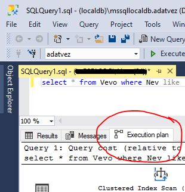

# Lekérdezés optimalizálás Microsoft SQL Server platformon

A labor során az eddig csak elméletben ismert lekérdezés optimalizálást vizsgáljuk a gyakorlatban. Azért, hogy a feladatok során megfelelően megértsük a működést, és dokumentálni is tudjuk, az első 4-5 feladat mindenképpen laborvezetővel együtt megoldott, a továbbiak önálló feladatok, ahol a laborvezető a szükséges magyarázatokat is megadja. A közös feladatmegoldás és az önálló feladatmegoldás eredményét is dokumentálni kell és be kell adni.

## Célkitűzés

A Microsoft SQL Szerver végrehajtó motorjának bemutatása és a végrehajtási tervek elemzésének megismerése példákon keresztül, továbbá a markdown fájlformátum alapvető megismerése a labor feladatainak dokumentálása során.

## Előfeltételek, felkészülés

A labor elvégzéséhez szükséges eszközök:

- [Visual Studio Code](https://code.visualstudio.com/) vagy más, markdown kompatibilis szerkesztő
- Microsoft SQL Server
  - Express változat ingyenesen használható, avagy Visual Studio mellett feltelepülő _localdb_ változat is megfelelő
- [SQL Server Management Studio](https://docs.microsoft.com/en-us/sql/ssms/download-sql-server-management-studio-ssms)
- Az adatbázist létrehozó script: [mssql.sql](https://raw.githubusercontent.com/bmeviauac01/gyakorlatok/master/mssql.sql)

A labor elvégzéséhez használható segédanyagok és felkészülési anyagok:

- Markdown formátum [rövid ismertetője](https://guides.github.com/features/mastering-markdown/) és [részletes dokumentációja](https://help.github.com/en/github/writing-on-github/basic-writing-and-formatting-syntax)
- Microsoft SQL Server használata: [leírás](https://bmeviauac01.github.io/gyakorlatok/Adatbazis/mssql-server.html) és [videó](https://youtu.be/gmY8reqSL7U)
- Az adatbázis [sémájának leírása](https://bmeviauac01.github.io/gyakorlatok/Adatbazis/sema.html)
- Microsoft SQL Server lekérdezés optimalizálása
  - Lásd az Adatvezérelt rendszerek c. tárgy [jegyzetei](https://www.aut.bme.hu/Course/adatvezerelt) között

## Előkészület

A feladatok megoldása során ne felejtsd el követni a [feladat beadás folyamatát](../GitHub-hasznalat.md).

### Git repository létrehozása és letöltése

1. Az alábbi URL-en keresztül hozd létre a saját repository-dat: TBD

1. Várd meg, míg elkészül a repository, majd checkout-old ki.

   > Egyetemi laborokban, ha a checkout során nem kér a rendszer felhasználónevet és jelszót, és nem sikerül a checkout, akkor valószínűleg a gépen korábban megjegyzett felhasználónévvel próbálkozott a rendszer. Először töröld ki a mentett belépési adatokat (lásd a kezdőoldalon a leírást), és próbáld újra.

1. Hozz létre egy új ágat `megoldas` néven, és ezen az ágon dolgozz.

1. A `neptun.txt` fájlba írd bele a Neptun kódodat. A fájlban semmi más ne szerepeljen, csak egyetlen sorban a Neptun kód 6 karaktere.

### Markdown fájl megnyitása

A feladatok megoldása során a dokumentációt markdown formátumban készítsd. Az előbb letöltött git repository-t nyisd meg egy markdown kompatibilis szerkesztővel. Javasolt a Visual Studio Code használata:

1. Indítsd el a VS Code-ot.

1. A _File > Open Folder..._ menüvel nyisd meg a git repository könyvtárát.

1. A bal oldali fában keresd meg a `README.md` fájlt és dupla kattintással nyisd meg.

   - Ezt a fájlt szerkeszd.
   - Ha képet készítesz, azt is tedd a repository alá a többi fájl mellé. Így relatív elérési úvonallal (fájlnév) fogod tudni hivatkozni.

     > Tipp: Legjobb, ha nem használsz ékezetes karaktereket és szóközöket a fájlnévben.

1. A kényelmes szerkesztéshez nyisd meg az [előnézet funkciót](https://code.visualstudio.com/docs/languages/markdown#_markdown-preview).

> Ha nem szimpatikus ez a szerkesztő, használhatod a [GitHub webes felületét is](https://help.github.com/en/github/managing-files-in-a-repository/editing-files-in-your-repository) a dokumentáció szerkesztéséhez, itt is van előnézet. Ekkor a [fájlok feltöltése](https://help.github.com/en/github/managing-files-in-a-repository/adding-a-file-to-a-repository) kicsit körülményesebb lesz.

### Adatbázis létrehozása

1. Kapcsolódj Microsoft SQL Serverhez SQL Server Management Studio Segítségével. Indítsd el az alkalmazást, és az alábbi adatokkal kapcsolódj.

   - Server name: `(localdb)\mssqllocaldb` vagy `.\sqlexpress` (ezzel egyenértékű: `localhost\sqlexpress`)
   - Authentication: `Windows authentication`

1. Hozz létre egy új adatbázist (ha még nem létezik). Az adatbázis neve legyen a Neptun kódod: _Object Explorer_-ben Databases-en jobb kattintás, és _Create Database_.

   > Fontos, hogy az adatbázis neve egyezzen meg a Neptun kódoddal. A labor megoldásában kérünk képernyőképeket, amelyeken így kell szerepelnie az adatbázisnak!

1. Hozd létre a minta adatbázist a generáló script lefuttatásával. Nyiss egy új _Query_ ablakot, másold be a script tartalmát, és futtasd le. Ügyelj az eszköztáron levő legördülő menüben a megfelelő adatbázis kiválasztására.

   

1. Ellenőrizd, hogy létrejöttek-e a táblák. Ha a _Tables_ mappa ki volt már nyitva, akkor frissíteni kell.

   .

### Lekérdezési terv bekapcsolása

Az összes feladat során szükségünk lesz a legjobb lekérdezési tervre, amit a szerver végeredményben választott. Ezt SQL Server Management Studio-ban a _Query_ menüben az [_Include Actual Execution Plan_ opcióval](https://docs.microsoft.com/en-us/sql/relational-databases/performance/display-an-actual-execution-plan) kapcsolhatjuk be.

A tervet a lekérdezés lefuttatása után az ablak alján, az eredmények nézet helyett választható _Execution plan_ lapon találjuk.

A lekérdezési terv a diagramot adatfolyamként kell olvasnunk, az adat folyásának iránya a lekérdezés végrehajtása. Az egyes elemek a lekérdezési terv műveletei, a százalékos érték pedig az egész lekérdezéshez viszonyított relatív költség.

## Feladatok

Összesen 15 + 2 feladat van, az utolsó 2 opcionális. [Itt találod](Feladat.md) a feladatokat.

## Végezetül: a megoldások feltöltése

1. Ellenőrizd, hogy a `neptun.txt`-ben szerepel-e a Neptun kódod.
1. Ellenőrizd, hogy a dokumentációt az előkészített `README.md` fájlba írtad-e.
1. Ellenőrizd, hogy a lekérdezési tervek illusztrálásához készített képernyőképeket elmentetted-e a repository-ba, és a markdown-ban hivatkoztad-e.
1. Kommitold és pushold a megoldásod. Ellenőrizd a GitHub webes felületén, hogy minden rendben van-e. Ha mindent jól csináltál, a repository kezdőoldalán megjelenik a dokumentáció, és a hivatkozott képek is látszódnak benne.
1. Nyiss egy pull request-et a megoldásoddal és rendeld a laborvezetődhöz.
1. Ha tanszéki laborban vagy, töröld a GitHub belépési adatokat. A lépésekhez nézd meg a kezdőoldalon a leírást.
