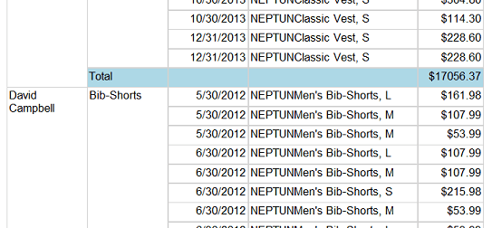

# Exercise 3: Sales personnel report

**This exercise is to be completed individually for 5 points.**

Let us create a new report about the effectiveness of the sales personnel.

## Extending the data set

The dataset we created in the Report Data panel has to be extended with further information.

1. Open the data set properties by right clicking on _AdventureWorksDataSet_ in the _Report Data_ pane, click _Dataset properties_ then change the SQL command to:

    ```sql hl_lines="7 9 17"
    SELECT
      soh.OrderDate AS [Date],
      soh.SalesOrderNumber AS [Order],
      pps.Name AS Subcat, pp.Name as Product,
      SUM(sd.OrderQty) AS Qty,
      SUM(sd.LineTotal) AS LineTotal
     , CONCAT(pepe.FirstName, ' ', pepe.LastName) AS SalesPersonName
    FROM Sales.SalesPerson sp
      INNER JOIN Person.Person as pepe ON sp.BusinessEntityID = pepe.BusinessEntityID
      INNER JOIN Sales.SalesOrderHeader AS soh ON sp.BusinessEntityID = soh.SalesPersonID
      INNER JOIN Sales.SalesOrderDetail AS sd ON sd.SalesOrderID = soh.SalesOrderID
      INNER JOIN Production.Product AS pp ON sd.ProductID = pp.ProductID
      INNER JOIN Production.ProductSubcategory AS pps ON pp.ProductSubcategoryID = pps.ProductSubcategoryID
      INNER JOIN Production.ProductCategory AS ppc ON ppc.ProductCategoryID = pps.ProductCategoryID
    GROUP BY ppc.Name, soh.OrderDate, soh.SalesOrderNumber,
             pps.Name, pp.Name, soh.SalesPersonID
            , pepe.FirstName, pepe.LastName
    HAVING ppc.Name = 'Clothing'
    ```

    Don’t forget to press _Refresh fields_ before closing the dialog.  Close the dialog.

1. In the _Report data_ expand _AdventureWorksDataset_ (if already expanded, close then re-expand). A new field _SalesPersonName_ will appear.

1. Right click the data source _AdventureWorks2014_ and choose _Convert to shared Data Source_, and then repeat this with the _AdventureWorksDataSet_ too. These will enable us to use them in a new report.

## New report and data sources

We will use the converted and shared data source and data set in a new report.

1. In the _Solution Explorer_ right click _Reports_ and choose _Add_ > _New Item_ > _Report_.
 The name of this new report should be "Sales People".

1. Open the new report. There are no data sources associated with the report. Use the _Report Data_ pane to add the existing one:

    - Right click _Data Source_ and choose _Add Data Source_

    - Click the _Use shared data source reference_ option and select "AdventureWorks2014".

         

    - Right lick _Datasets_ > _Add Dataset_

    - Click _Use a shared dataset_ and select the existing AdventureWorksDataset

        

## Contents of the report

Create a tabular report containing the sales persons and their activity. Group by product category and sales person. Add a total line for each person. Make sure to set appropriate formatting of numbers.

The key is creating the table and grouping as below. The category is the field _Subcat_.


The final report should look like this:



!!! tip "Tip"
    You should use the _Add total_ > _After_ just like before. But you should do this by clicking on `[Subcat]` and **not**`[SalesPersonName]`! (If you click SalesPersonName to add the total, it will be a "grand total" adding up all persons.)

!!! example "SUBMISSION"
    Create a screenshot of the **report preview** page. Save the screenshot as `f3.png` and submit with the other files of the solution. The screenshot shall include Visual Studio and the report preview. Verify that your **Neptun code** is visible in the table!
