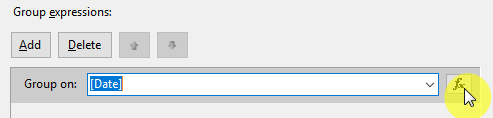
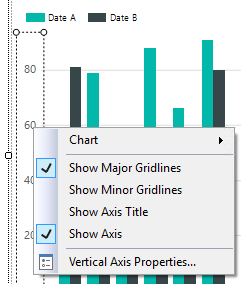

# Feladat 2: Vizualizáció (5p)

A táblázatos megjelenítés részletesen mutatja az eladási adatokat. Egy diagram azonban gyorsabban áttekinthetővé magasz szinten nézve az adatokat. Készítsünk egy diagramot, az egyes termékkategóriák eladásait mutatja.

## Diagram beszúrása

1. Váltsunk _Design_ nézetre, és húzzunk be egy _Chart_-ot a _Toolbox_-ról a táblázat mellé. Ennek hatására elég sokáig fog tölteni a diagram varázsló, de egy idő után megnyílik. Válasszuk ki az oszlopdiagram típust.

1. A _Report Data_ panelről húzzuk a _LineTotal_ mezőt a diagramra. **Még ne engedjük fel a bal egérgombot.** Meg fog jelenni a diagram mellett a _Chart Data_ ablak – itt a "∑ values" mező (a fehér téglalap) fölé vigyük az egeret. Most már elengedhetjük.

   

   Ezzel azt állítottuk be, hogy az eladás értékeiének összegét szeretnénk függőleges tengelynek.

1. Húzzuk a _Chart data_ alatt a _Category Groups_ mezőbe a _Subcat_ mezőt, a _Series Groups_-ba pedig a _Date_-et.

   

   Ezzel azt érjük el, hogy a vízszintes tengelyen az alkategória szerint külön oszlop csoportokat kapunk, és a dátum szerint pedig külön oszlop sorozatokat.

1. A \[Date\] feliraton jobb klikkeljünk, és válasszuk a _Series Groups Properties_-t. Itt nyomjuk meg a _Group Expressions_ csoportban az **_fx_** gombot

   

   A megjelenő ablakban írjuk be: `=Year(Fields!Date.Value)`

   

   Ezzel a dátum éve szerinti oszlopokat fogunk kapni.

1. Nyomjunk OK-t mindkét ablakban. Mielőtt megnéznénk a _Preview_-t, növeljük meg a diagram magasságát bőséggel, különben a jelmagyarázat nem fog kiférni:

   

1. Ha most megnézzük a Preview-t, az egyes kategóriák termelte bevételt fogjuk látni, év szerint csoportosítva:

   

## A diagram formázása

A megjelenés még nem az igazi, de ezen könnyen segíthetünk.

1. _Chart Title_-re kattintva írjuk át a diagram címét, pl. "Revenue by category"

1. A _Series Groups_ mezőben az _<\<Expr\>>_ feliratra jobb klikkelve válasszuk ki a _Series Groups Properties_-t, és itt a _Label_ mező mellett nyomjuk meg az **_fx_** gombot. Értéknek adjuk meg: `=Year(Fields!Date.Value)`.

1. Jobb klikkeljünk a függőleges tengely címkéin, és válasszuk a _Vertical Axis Properties_ lehetőséget.

   

   Itt a _Number_ fülön válasszuk a _Currency_ lehetőséget, és töltsük ki a már ismert módon:

   

1. Ha most megnézzük a _Preview_ fület, már szép lesz a riportunk:

   

1. Készíts egy képernyőképet a diagram előnézetéről. (A képernyőképpel kapcsolatos elvárásokról lásd a kezdőoldalon.)

   > A képet a megoldásban `f2-chart.png` néven add be. A képernyőképen a Visual Studio ablaka, és azon belül a riport előnézetében a diagram látszódjon.
   >
   > A képernyőkép szükséges feltétele a feladat teljesítésének.

## Következő feladat

Folytasd a [következő feladattal](Feladat-3.md).
