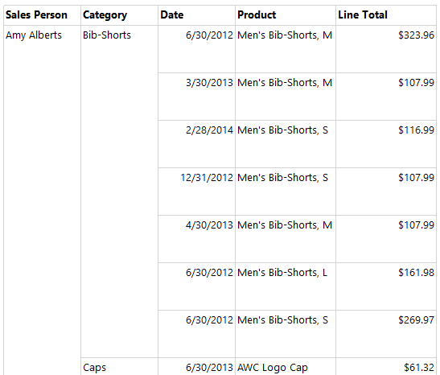
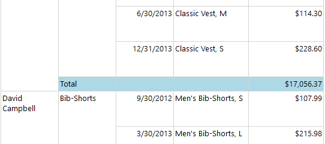

# Feladat 3: Értékesítői riport (5p)

Ebben a feladatban az értékesítőkről fogunk riportot készíteni.

## Data set kiegészítése

Az új riporthoz új adatokra lesz szükségünk. Bővítsük ki a lekérdezésünket, azaz a _dataset_-et.

1. A _Report Data_ panelen a _DataSets_ alatt az _AdventureWorksDataset_-en jobb kattintással válasszuk a _Dataset properties_-t, majd bővítsük a query-t:

   ```diff
   SELECT
     soh.OrderDate AS [Date],
     soh.SalesOrderNumber AS [Order],
     pps.Name AS Subcat, pp.Name as Product,
     SUM(sd.OrderQty) AS Qty,
     SUM(sd.LineTotal) AS LineTotal,
   +  CONCAT(pepe.FirstName, ' ', pepe.LastName) AS SalesPersonName
   FROM Sales.SalesPerson sp
     INNER JOIN Person.Person as pepe ON sp.BusinessEntityID = pepe.BusinessEntityID
     INNER JOIN Sales.SalesOrderHeader AS soh ON sp.BusinessEntityID = soh.SalesPersonID
     INNER JOIN Sales.SalesOrderDetail AS sd ON sd.SalesOrderID = soh.SalesOrderID
     INNER JOIN Production.Product AS pp ON sd.ProductID = pp.ProductID
     INNER JOIN Production.ProductSubcategory AS pps ON pp.ProductSubcategoryID = pps.ProductSubcategoryID
     INNER JOIN Production.ProductCategory AS ppc ON ppc.ProductCategoryID = pps.ProductCategoryID
   GROUP BY ppc.Name, soh.OrderDate, soh.SalesOrderNumber,
            pps.Name, pp.Name, soh.SalesPersonID
   +        , pepe.FirstName, pepe.LastName
   HAVING ppc.Name = 'Clothing'
   ```

1. A _Refresh Fields_ gombra kattintva ellenőrizhetjük, sikerült-e jól beírnunk. Ha nem jön hibaüzenet, akkor jók vagyunk. Zárjuk be a szerkesztő ablakot.

1. A _Report data_ ablakban az _AdventureWorksDataset_-et nyissuk ki, vagy ha ki van nyitva, akkor csukjuk be és nyissuk ki újra. Ekkor meg kell jelenjen egy új _SalesPersonName_ mező.

1. Ezután jobb klikk a Data Sources-ben az _AdventureWorks2014_-re > _Convert to shared Data Source_, majd jobb klikk az _AdventureWorksDataset_-re > _Convert to shared Dataset_.

   Ezzel a data source és a dataset is megosztható több riport fájl között.

## Új riport és adatforrások

Az előbb megosztottá konvertáltuk a data source-t és dataset-et. Ezeket fogjuk egy új riportban felhasználni.

1. _Solution Explorer_-ben jobb klikk a _Reports_ mappára > _Add new
   item_ > _Report_. Az új riport neve legyen "Sales People".

1. Nyissuk meg az új riportot. Az új riporthoz még nincsenek adatforrások. A _Report Data_ panelen vegyük fel a már meglevő adatforrásokat:

   - Jobb klikk a _Data Sources_ node-on > _Add Data Source_

   - Válasszuk a _Use shared data source reference_ opciót, és válasszuk ki az "AdventureWorks2014" nevűt.

     

   - Jobb klikk a _Datasets_-en > _Add Dataset_

   - Válasszuk ki a _Use a shared dataset_ opciót, és alatta válasszuk ki a már létező AdventureWorksDataset-et

     

## Riport tartalma

1. Készíts táblázatos riportot arról, hogy az egyes értékesítők mikor, mit adtak el. Csoportosíts termék kategória és értékesítő szerint. Ügyelj a számértékek formázására!

   

   A megoldás kulcsa az alábbi táblázat és csoportosítás összeállítása. A
   kategóriát a _Subcat_ mező tartalmazza.

   

1. Készíts összegző sort, ami az egyes értékesítők mindenkori eladásait összegzi!

   

   > Tipp: Ugyanúgy az _Add Total_ > _After_ funkciót kell használni, mint a közös feladatoknál. Amit itt el lehet rontani, hogy az _Add Total_ > _After_-t **nem** a \[SalesPersonName\]-en jobb klikkelve kell kiválasztani, hanem a \[Subcat\]-en jobbklikkelve – hiszen őket akarjuk összegezni, nem a Sales Person sorokat. (Ha a SalesPersonName-re kattintva csináljuk, abból Grand Total lesz, hiszen minden értékesítőt összegzünk.)

1. Készíts egy képernyőképet a riport előnézetéről. (A képernyőképpel kapcsolatos elvárásokról lásd a kezdőoldalon.)

   > A képet a megoldásban `f3-table.png` néven add be. A képernyőképen a Visual Studio ablaka, és azon belül a riport előnézete látszódjon. Látszódjon legalább egy összegző sor is a nézetben.
   >
   > A képernyőkép szükséges feltétele a feladat teljesítésének.

## Következő feladat

Folytasd az [opcionális feladattal](Feladat-4.md) vagy add be a megoldásod az [itt](README.md) leírtak szerint.
