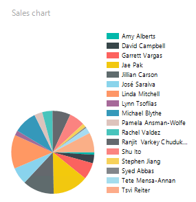

# Feladat 4: Opcionális feladat (3 iMsc pont)

1. Készíts tortadiagramot az egyes értékesítők teljesítményének összehasonlítására, a hozzájuk tartozó összbevétel szerint!

   

   > Tipp: A tortadiagram használata nagyon hasonló az oszlopdiagraméhoz. A lényeg, hogy a _∑ Values_ mezőbe a _LineTotal_-t, a _Category Groups_-ba a _SalesPersonName_-et húzzuk. (A _Series Groups_ ezúttal üres.) A diagram magasságát most is nyújtani kell, hogy a teljes jelmagyarázat kiférjen.

   

1. Készíts egy képernyőképet a riport előnézetéről. (A képernyőképpel kapcsolatos elvárásokról lásd a kezdőoldalon.)

   > A képet a megoldásban `f4-chart.png` néven add be. A képernyőképen a Visual Studio ablaka, és azon belül a riport előnézetén belül a diagram látszódjon.
   >
   > A képernyőkép szükséges feltétele a feladat teljesítésének.

## Következő feladat

Nincs több feladat. Add be a megoldásod az [itt](README.md) leírtak szerint.
